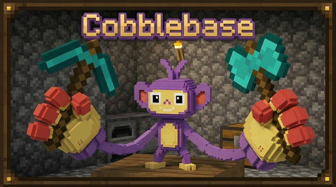

<p align="center">
  
</p>

<h1 align="center">Cobblebase ⚡</h1>

<p align="center"><b>Palworld-style base management for Cobblemon — assign jobs, watch Pokemon work, build the ultimate base.</b></p>

<p align="center">

[](https://minecraft.net)
[](https://cobblemon.com)
[](https://fabricmc.net)
[](https://opensource.org/licenses/MPL-2.0)
[](https://discord.gg/6As3sVZgVT)
[](https://ko-fi.com/notlown)
[](https://modrinth.com/project/cobblebase)

</p>

---

## Overview

**Cobblebase** transforms the Pasture Block into a living, breathing Pokemon base. Every Pokemon species has hand-crafted job skills and proficiency levels — not based on type, but on identity. A Charizard fills lava cauldrons and guards your base. An Alakazam mentors your entire team. A Mew recruits legendaries.

- 💎 **150+ Pokemon** with unique, hand-crafted skill assignments
- ⚡ **30 skills** across 8 categories — gathering, finding, combat, support, logistics, exploration, environmental, and recruiting
- ⭐ **Proficiency 1–5** per skill per species — novice to master
- 🎯 **Tabbed GUI** with Skills, Buffs, Logs, and Discovery panels
- 🛡️ **Fully configurable** via Cloth Config and JSON datapacks

---

## 🌾 Gathering

Pokemon harvest, fish, mine, and collect resources from the world around your base.

| Job | Description | Example Pokemon |
|-----|-------------|-----------------|
| 🌾 **Harvester** | Picks apricorns, crops, berries, mints, tumblestones | Venusaur (5), Scizor (5), Celebi (5) |
| 🎣 **Fishing** | Navigates to water and catches fish/loot | Gyarados (5), Blastoise (5), Kyogre (5) |
| ⛏️ **Mining** | Digs for ores, fossils, gems, and tumblestones | Steelix (5), Golem (5), Excadrill (5) |
| 🍯 **Honey Collect** | Gathers honey from bee nests | Vespiquen (5), Beedrill (4), Combee (4) |

---

## 🔍 Finding

Twelve specialized Finder subtypes with dedicated loot tables for targeted item discovery.

| Job | Focus | Example Loot |
|-----|-------|--------------|
| 🧪 **Alchemist** | Evolution items | Fire/Thunder Stone, Linking Cord, Ability Patch |
| 💊 **Pharmacist** | Healing items | Potions, Revives, Sacred Ash |
| 🏗️ **Architect** | Building materials | Prismarine, Sea Lantern, Crying Obsidian |
| ⛏️ **Excavator** | Ores and minerals | Raw Iron/Gold, Diamond, Ancient Debris |
| 🌱 **Botanist** | Seeds, plants & mulch | Apricorn Seeds, Mint Seeds, Mulch, Torchflower Seeds |
| 📦 **Collector** | Pokeballs | Great Ball, Apricorn Balls, Master Ball |
| 📚 **Scholar** | XP Candies | Exp Candy XS–XL, Rare Candy |
| 🍳 **Chef** | Food & cooking | Ponigiri, Lava Cookie, Enchanted Golden Apple |
| 💪 **Trainer** | Vitamins & training | HP Up, Protein, Ability Patch |
| ⚔️ **Armorer** | Battle held items | Choice Band, Life Orb, Focus Sash |
| 💰 **Prospector** | Relics & treasure | Relic Coins, Gold, Netherite Ingot |
| 🔨 **Smith** | Smithing templates & pottery | Armor Trims, Pottery Sherds, Netherite Upgrade |

Pharmacist is auto-assigned to Healer Pokemon, Botanist to Harvesters, Scholar to Mentors, and Collector to collectors like Aipom and Zigzagoon.

---

## ⚔️ Combat

| Job | Description | Example Pokemon |
|-----|-------------|-----------------|
| 🛡️ **Guard** | Patrols the area, repels wild Pokemon for XP and loot | Gallade (4), Scizor (4), Incineroar (4) |

---

## 💚 Support

Healing, mentoring, and 8 buff skills that apply status effects to all players within 16 blocks.

| Job | Effect | Example Pokemon |
|-----|--------|-----------------|
| 💚 **Healer** | Direct % HP healing + revive fainted Pokemon | Blissey (5), Togekiss (4), Chansey (4) |
| 🎓 **Mentor** | Passive XP boost for all Pokemon in the pasture | Alakazam (5), Metagross (4), Gardevoir (4) |
| ⚡ **Speed Boost** | Speed II | Ninjask (5), Jolteon (4), Rapidash (4) |
| 💪 **Strength Boost** | Strength I | Machamp (4), Hariyama (4), Conkeldurr (4) |
| 🛡️ **Resistance Boost** | Resistance I | Steelix (5), Aggron (4), Bastiodon (4) |
| 👁️ **Night Vision** | Night Vision | Umbreon (5), Noctowl (4), Espeon (3) |
| 🫧 **Water Breathing** | Water Breathing | Lapras (5), Vaporeon (4), Milotic (4) |
| 🦘 **Jump Boost** | Jump Boost I | Lopunny (4), Hitmonlee (4), Blaziken (3) |
| ⚒️ **Haste Boost** | Haste I | Alakazam (4), Metagross (3), Kadabra (3) |
| 🍖 **Saturation** | Saturation | Slurpuff (5), Snorlax (4), Munchlax (4) |

Buff duration and cooldown scale with proficiency — at Prof 5, buffs are effectively permanent (70s duration, 0s cooldown).

---

## 📦 Logistics

| Job | Description | Example Pokemon |
|-----|-------------|-----------------|
| 📥 **Gatherer** | Picks up dropped items and sorts them into nearby chests | Ambipom (5), Furret (4), Munchlax (4) |

Smart sorting prioritizes chests already containing the same item type. Search radius scales from 5 blocks (Prof 1) to 12 blocks (Prof 5).

---

## 🔭 Exploration

| Job | Description | Example Pokemon |
|-----|-------------|-----------------|
| 🔭 **Scout** | Discovers wild Pokemon, structures, and biomes | Ninjask (5), Pidgeot (4), Talonflame (4) |

| Proficiency | Range | Discovers |
|-------------|-------|-----------|
| 1–2 | 50–100 blocks | Wild Pokemon only |
| 3 | 120 blocks | + Structures (Villages, Mineshafts, Shipwrecks) |
| 4–5 | 160–200 blocks | + Rare Biomes (Mushroom Fields, Deep Dark, Cherry Grove) |

All discoveries persist permanently and appear in the Discovery GUI tab.

---

## 🌿 Environmental

Pokemon that interact with blocks and containers around your base.

| Job | Description | Example Pokemon |
|-----|-------------|-----------------|
| 💧 **Irrigator** | Hydrates nearby farmland | Venusaur (4), Sceptile (3), Meganium (3) |
| 🌋 **Lava Fill** | Fills cauldrons with lava | Magmortar (5), Charizard (4), Magmar (4) |
| 💦 **Water Fill** | Fills cauldrons with water | Vaporeon (5), Blastoise (4), Swanna (3) |
| ❄️ **Snow Fill** | Fills cauldrons with powder snow | Articuno (5), Glaceon (4), Abomasnow (3) |
| 🔥 **Furnace Fuel** | Adds burn time to furnaces | Moltres (5), Entei (5), Charizard (4) |
| 🧪 **Brew Fuel** | Fuels brewing stands | Weezing (4), Dragonite (3), Koffing (2) |

---

## 🎯 Recruiting

Pokemon that attract and spawn new wild Pokemon near your base.

| Job | Description | Example Pokemon |
|-----|-------------|-----------------|
| 🤝 **Friend Recruiter** | Spawns wild Pokemon of same type | Togekiss (5), Sylveon (4), Gardevoir (4) |
| ⭐ **Legendary Recruiter** | Spawns rare/legendary Pokemon (longer cooldown) | Arceus (5), Mew (5), Jirachi (5) |

Friend Recruiter uses official Cobblemon 1.7.3 spawn bucket data for accurate rarity distribution:

| Proficiency | Common | Uncommon | Rare | Ultra-Rare |
|-------------|--------|----------|------|------------|
| 1 | 93.8% | 5.0% | 1.0% | 0.2% |
| 3 | 90.3% | 7.5% | 1.5% | 0.3% |
| 5 | 86.8% | 10.0% | 2.0% | 0.4% |

---

## ⭐ Proficiency System

Every Pokemon has a proficiency level (1–5) for each of its skills. Higher proficiency means faster cooldowns, larger range, and better loot quality.

| Level | Title | Cooldown Multiplier | Effect |
|-------|-------|---------------------|--------|
| 1 | Novice | 1.67x (slower) | Base rates, small range |
| 2 | Apprentice | 1.33x | Slightly improved |
| 3 | Skilled | 1.00x (normal) | Standard performance |
| 4 | Expert | 0.67x (faster) | Better loot tiers, wider range |
| 5 | Master | 0.33x (fastest) | Best rates, maximum range |

A Magikarp with Fishing Prof 1 is slow. A Gyarados with Fishing Prof 5 is a machine.

---

## 🎵 GUI — Tabbed Interface

Open any Pasture Block and click the **"Cobblebase"** button to access the management interface.

| Tab | What It Shows |
|-----|---------------|
| **Skills** | Per-Pokemon skill list. Click to assign (green = active). Auto or manual mode. |
| **Buffs** | All active jobs/effects for this pasture. Color-coded by category with proficiency stars. |
| **Logs** | Recent activity log. Filterable by rarity (Uncommon+, Rare+, Ultra Rare). Last 100 events. |
| **Discovery** | Permanent scout discoveries — structures and biomes with coordinates. Filterable and persistent. |

---

## Configuration

Press **K** to open the Cloth Config settings screen. Key options:

- **Dev Mode** — 5-second cooldowns for testing
- **Passive XP** — Toggle, percentage (default 5%), interval (default 60s)
- **Skill Toggles** — Enable/disable entire skill categories
- **Recruiter Settings** — Cooldowns and spawn rates for Friend/Legendary Recruiters
- **Search Radius** — Default block search radius for all skills
- **Mentor Max Boost** — Cap the mentor XP multiplier (default 100% at Prof 5)

Everything is also JSON-configurable and customizable via **datapacks** — server admins can add skills, modify loot tables, or reassign Pokemon species without touching code.

---

## Installation

### Requirements
- Minecraft **1.21.1**
- Fabric Loader **0.16.14+**
- Fabric Language Kotlin
- Cobblemon **1.7.0+**

### Steps
1. Download the latest JAR from [Releases](https://github.com/notlown/cobblebase/releases)
2. Place it in your `mods/` folder alongside Cobblemon and Fabric Language Kotlin
3. Launch the game — press **K** to configure settings

### Building from Source
```bash
git clone https://github.com/notlown/cobblebase.git
cd cobblebase
./gradlew fabric:build
```
Output JAR in `fabric/build/libs/`. Requires **Java 21**.

---

## 💬 Community & Support

<table>
  <tr>
    <td align="center" width="50%">
      <a href="https://discord.gg/6As3sVZgVT">
        
      </a>
    </td>
    <td align="center" width="50%">
      <a href="https://ko-fi.com/notlown">
        
      </a>
    </td>
  </tr>
</table>

---

## Credits

- Inspired by [Cobbleworkers](https://github.com/Accieo/cobbleworkers) by [Accieo](https://github.com/Accieo)
- Built by [notlown](https://github.com/notlown)

## License

Licensed under [MPL-2.0](https://mozilla.org/MPL/2.0/)
